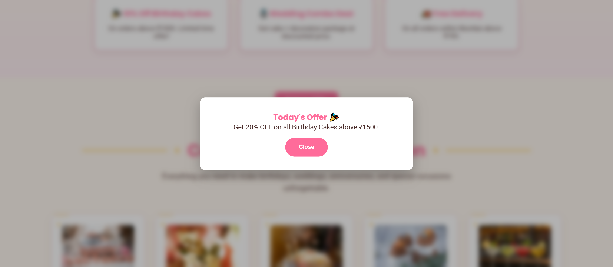
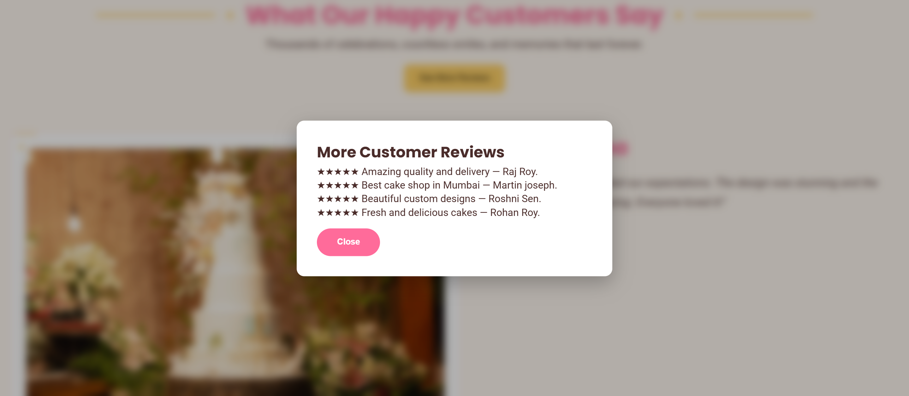

# Cake Shop Website - Project 3

## Overview

This project was developed as part of the DecodeLabs Frontend Development Internship.

The objective of Project 3 was to add interactivity to a webpage using JavaScript and DOM manipulation techniques.

## Project Preview

### Homepage

### Dark Mode Toggle

### Add To Cart Functionality

### Offer Popup

### Review Popup

## Features

- Dark Mode Toggle
- Add To Cart Functionality
- Dynamic Cart Counter
- Customer Review Popup
- Special Offer Popup
- Local Storage Support
- Responsive Navigation
- Interactive Buttons

## Technologies Used

- HTML5
- CSS3
- JavaScript
- DOM Manipulation
- Local Storage

## Learning Outcomes

- JavaScript Fundamentals
- Event Handling
- DOM Manipulation
- Local Storage Usage
- Interactive UI Development

## Status

✅ Completed

## Author

Sanskruti Shelar 
Frontend Development Intern 
DecodeLabs
